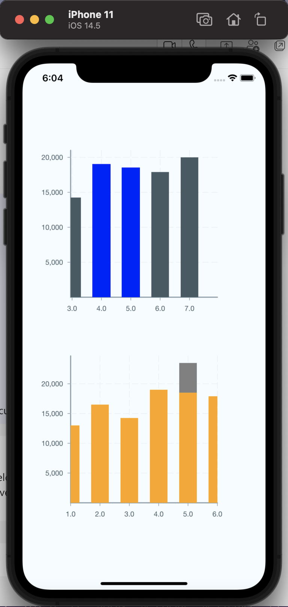

# Victory Native VictoryStack Issues

This example showcases some issues with using `VictoryStack` component with `VictoryBar`.

## 1. `src/NormalBarDemo`

It contains example code that just has a standard victory native bar chart which panning works well.

## 2. `src/StackedBarDemo`

It contains example code to that has a stacked bars. We found two issues:

1.) After wrapping the `VictorPyBar` with the `VictoryStack`, the rendering works well. However, the `onPressIn`, `onPress` and `onPressOut` events seem to only get fired for the first time.

2.) Panning on the bars does not seem to work anymore when we pass any `events` on the `VictoryBar`, we can only pan on non-bar area on the chart. However, if we remove the `events` props on the `VictoryBar`, the panning will work again, unfortunately we need to handle some `onPressIn` events and can't achieve our features without using `events`.

## 3. A short gif about the issues:

